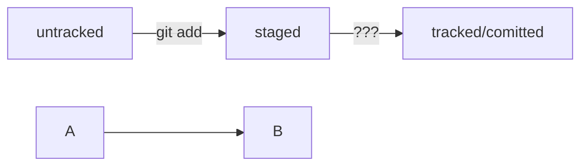

# task1
## Базовые команды в Git
```
git push
git add <file_name>
git commit -m "Your message"
git push
touch <file_name>
rm <file_name>
```
HEAD -- это голова.
Коммит -- это всему голова.
Статусы файлов:
<тут пустая строка!>


